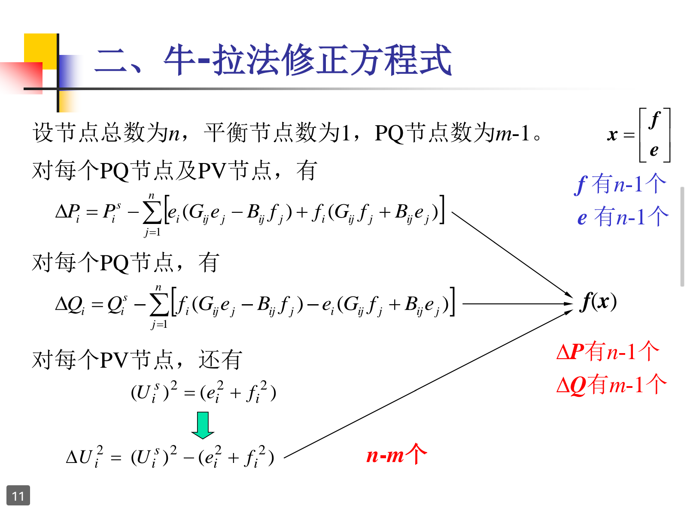
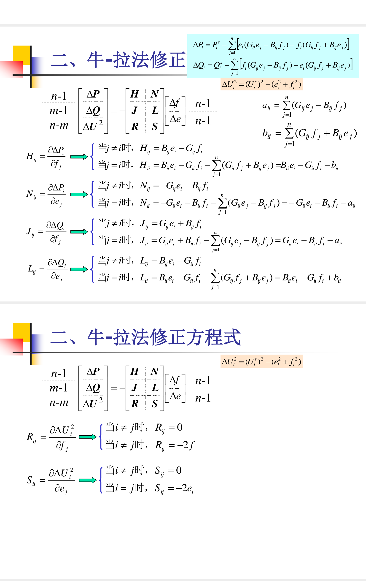

# 牛-拉法直角坐标系潮流计算

## 伪代码：
```
main loop:
    delta_PQU2 = g_delta()
    J = jacobi()
    delta_fe = inv_J * delta_PQU2
    f += delta_f
    e += delta_e
    if error < epison:
        break
```
先确定节点导纳矩阵，ef初始值，PQU给定值

## 生成$\Delta P ,\Delta Q ,\Delta U^2$



## 生成雅克比矩阵

